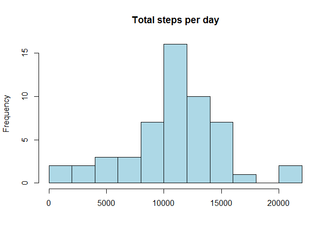
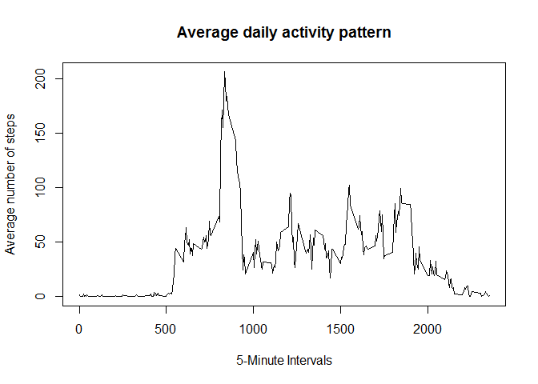
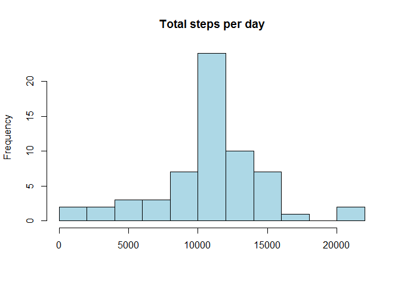
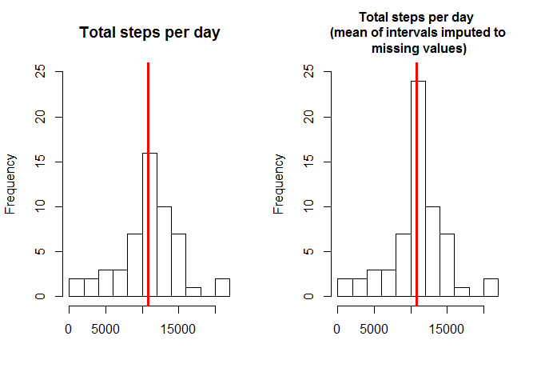
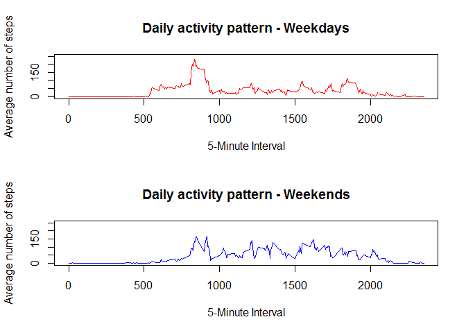

# Peer-graded Assignment: Course Project 1
Reproducible Research  

## 1. Load the data


```r
activity <- read.csv("./activity.csv", stringsAsFactors = FALSE)
str(activity)
```

```
## 'data.frame':	17568 obs. of  3 variables:
##  $ steps   : int  NA NA NA NA NA NA NA NA NA NA ...
##  $ date    : chr  "2012-10-01" "2012-10-01" "2012-10-01" "2012-10-01" ...
##  $ interval: int  0 5 10 15 20 25 30 35 40 45 ...
```

## 2. Process/transform the data

```r
activity$date <- as.Date(activity$date)
colSums(is.na(activity))
```

```
##    steps     date interval 
##     2304        0        0
```

## 3. What is mean total number of steps taken per day?
#### Calculate the total number of steps taken per day


```r
activity_nomissing <- activity[which(!is.na(activity$steps)),]
aggregate_activity <- tapply(activity_nomissing$steps, activity_nomissing$date, sum)
```

#### Make a histogram of the total number of steps taken each day

```r
hist(aggregate_activity, 10, main = "Total steps per day", xlab = "", col = "lightblue")
```

<!-- -->

#### Calculate and report the mean and median of the total number of steps taken per day

```r
mean(aggregate_activity)
```

```
## [1] 10766.19
```

```r
median(aggregate_activity)
```

```
## [1] 10765
```

#### What is the average daily activity pattern?

```r
daily_activity<-tapply(activity_nomissing$steps, activity_nomissing$interval, mean)
plot(x = names(daily_activity), y = daily_activity, type = "l", xlab = "5-Minute Intervals", 
     main = "Average daily activity pattern", ylab = "Average number of steps")
```

<!-- -->

```r
daily_activity[daily_activity==max(daily_activity)]
```

```
##      835 
## 206.1698
```

## 4. Imputing missing values


```r
#### Calculate and report the total number of missing values in the dataset
colSums(is.na(activity))
```

```
##    steps     date interval 
##     2304        0        0
```

#### Devise a strategy for filling in all of the missing values in the dataset


```r
activity_2 <- activity
activity_2[which(is.na(activity_2$steps)),1] <- daily_activity[as.character(activity_2[which(is.na(activity_2$steps)),3])]
colSums(is.na(activity_2))
```

```
##    steps     date interval 
##        0        0        0
```

#### Create a new dataset that is equal to the original dataset but with the missing data filled in


```r
aggregate_activity_2<-tapply(activity_2$steps, activity_2$date, sum)
hist(aggregate_activity_2, 10, main = "Total steps per day", xlab = "", col = "lightblue")
```

<!-- -->

#### Make a histogram of the total number of steps taken each day and Calculate and report the mean and median total number of steps taken per day. Do these values differ from the estimates from the first part of the assignment? What is the impact of imputing missing data on the estimates of the total daily number of steps?


```r
mean(aggregate_activity_2)
```

```
## [1] 10766.19
```

```r
median(aggregate_activity_2)
```

```
## [1] 10766.19
```

```r
par(mfrow=c(1,2))
hist(aggregate_activity, 10, main = "Total steps per day", xlab = "", ylim =c(0, 25))
abline(v = median(aggregate_activity), lwd = 3, col="red")
hist(aggregate_activity_2, 10, main = "Total steps per day \n (mean of intervals imputed to \n missing values)", cex.main=1, xlab = "", ylim =c(0, 25))
abline(v = median(aggregate_activity_2), lwd = 3, col="red")
```

<!-- -->

## 5. Are there differences in activity patterns between weekdays and weekends?

```r
activity_2$weekday<-weekdays(activity_2$date); activity_2$Is_weekend<- as.factor(c("weekend", "weekday"))
activity_2[activity_2$weekday == "domenica" | activity_2$weekday == "sabato",5]<- factor("weekend")
activity_2[!(activity_2$weekday == "domenica" | activity_2$weekday == "sabato"),5 ]<- factor("weekday")
```


```r
head(activity_2, 5)
```

```
##       steps       date interval weekday Is_weekend
## 1 1.7169811 2012-10-01        0  lunedì    weekday
## 2 0.3396226 2012-10-01        5  lunedì    weekday
## 3 0.1320755 2012-10-01       10  lunedì    weekday
## 4 0.1509434 2012-10-01       15  lunedì    weekday
## 5 0.0754717 2012-10-01       20  lunedì    weekday
```


```r
activity_2_weekend <- subset(activity_2, Is_weekend == "weekend") 
activity_2_weekday <- subset(activity_2, Is_weekend == "weekday") 
daily_activity_weekend<-tapply(activity_2_weekend$steps, activity_2_weekend$interval, mean)
daily_activity_weekday<-tapply(activity_2_weekday$steps, activity_2_weekday$interval, mean)
```

#### New graph

```r
par(mfrow=c(2,1))
plot(y = daily_activity_weekday, x = names(daily_activity_weekday), type = "l", xlab = "5-Minute Interval", main = "Daily activity pattern - Weekdays", ylab = "Average number of steps", col = 2, ylim =c(0, 250))
plot(y = daily_activity_weekend, x = names(daily_activity_weekend), type = "l", xlab = "5-Minute Interval", main = "Daily activity pattern - Weekends", ylab = "Average number of steps", col = 4, ylim =c(0, 250))
```

<!-- -->


